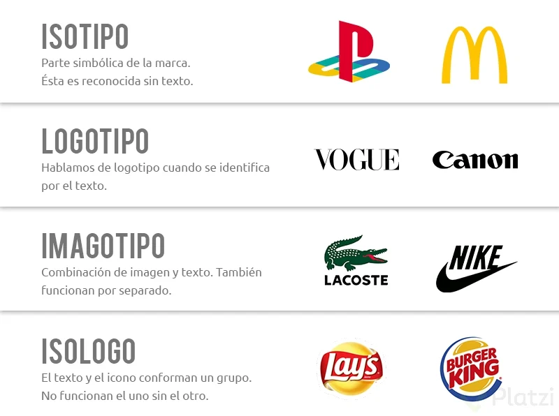

# Rediseño de marca

hoy empiezo a compartir con ustedes el emocionante proceso de rediseñar la marca de Bogotá. Vamos a hablar de por qué es necesario, qué vamos a cambiar y cómo lo haremos paso a paso, siempre con transparencia y ganas de construir juntos.

---

### **¿Por qué rediseñar una marca ciudad?**

Imaginen que tienen una chaqueta favorita. Con el tiempo, quizás se les queda pequeña, o ya no les representa como antes. Lo mismo pasa con las marcas de las ciudades. Bogotá hoy es distinta a la de hace 10 años: más diversa, más cultural, más conectada. Y su marca debe reflejar esa evolución.

Rediseñar no es borrar lo anterior, sino actualizarlo para que todos —desde el que vive en Suba hasta el que nos visita desde otro país— se sientan identificados y orgullosos. Queremos que cuando vean la marca de Bogotá, digan: “Ahí está mi ciudad, vibrante, llena de vida y oportunidades”.

---

### **¿Qué está cambiando y por qué importa?**

Varios factores hacen necesario este rediseño. No es un capricho, es una necesidad estratégica. Aquí les cuento los principales motivos:

- **Público objetivo:** Hoy Bogotá no solo le habla a sus ciudadanos, sino al mundo. Queremos atraer más turistas, inversionistas y talento internacional.
- **Mercado:** Las ciudades compiten entre sí por atención, eventos y recursos. Necesitamos una marca que se destaque entre otras capitales como Buenos Aires, CDMX o Lima.
- **Métricas:** Hoy medimos el impacto de manera distinta: engagement en redes, percepción de marca, recordación. La nueva identidad debe funcionar en lo digital y en lo físico.
- **Administración:** La marca debe ser fácil de usar por todas las entidades distritales, sin confusiones ni versiones desordenadas.
- **Estructura:** Bogotá es una ciudad compleja, con muchas caras. La marca debe unificar sin homogenizar.
- **Aplicaciones:** Desde una app móvil hasta la señalización de TransMilenio, la marca debe verse bien en todos lados.

---

### **¿Qué compone la identidad de marca?**

Una identidad de marca es como el outfit de una persona: no es solo la camisa, son los zapatos, los accesorios, los colores y hasta la actitud. Para Bogotá, vamos a diseñar:

- **Isotipo:** Es el símbolo o dibujo que representa la ciudad. Por ejemplo, la Torre Eiffel es el isotipo de París. Acá debe ser algo único, fácil de recordar y que hable de nuestra esencia.
- **Logotipo:** Es el nombre “Bogotá” escrito con una letra especial, que refleje nuestra personalidad.
- **Elementos gráficos complementarios:** Patrones, íconos, texturas y colores que usaremos en posters, sitios web, uniformes o publicidades. Imaginen un patrón inspirado en los cerros o en los tejidos indígenas, usado con moderación y sentido.

---

### **El brief: la hoja de ruta que nos guía**

Antes de dibujar nada, necesitamos un **brief**. Es como un mapa: nos dice a dónde vamos, con qué valores y bajo qué reglas. Sin él, cada quien haría lo que le gusta, y el resultado sería un caos.

En el brief inicial, estamos definiendo:

- **Valores:** Bogotá es cultural, diversa, incluyente, amable y vibrante. Queremos que la marca transmita eso.
- **Propósito:** Queremos que la marca una a la ciudad, que muestre cómo Bogotá late con su gente, conectando barrios, oportunidades y cultura.
- **Especificaciones:**
  - **Colores:** Usaremos los colores de la ciudad, pero con una paleta renovada y flexible.
  - **Tipografía:** Buscamos una fuente legible, moderna y que funcione tanto en pantalla como en impresos.
  - **Aplicaciones prioritarias:** Señalización urbana, redes sociales, sitio web, material turístico y merch oficial (sí, ¡habrá merch!).

---

### **¿Cómo les vamos a mostrar los avances?**

Este proceso será transparente y colaborativo

- Primeras hipótesis de diseño (bosquejos iniciales).
- Pruebas de color y tipografía.
- Exploraciones del isotipo y logotipo.
- Aplicaciones reales: cómo se vería la marca en una estación de TransMilenio, en un tuit, en un evento como Rock al Parque o en un folleto de turismo.

Habrá iteraciones: probaremos, recibiremos feedback y ajustaremos. No buscamos el diseño perfecto a la primera, sino el que mejor nos represente.

---

### **Nuestros compromisos**

Nos mueve un diseño responsable. Eso significa:

- **Consistencia:** Que la marca se vea y sienta igual en todos lados.
- **Legibilidad:** Que todos puedan leerla y entenderla, sin importar la edad o condición.
- **Inclusión:** Que represente a toda la ciudad, no solo a una parte.
- **Escalabilidad:** Que funcione en una pantalla de celular y en un avión.
- **Sostenibilidad:** Priorizaremos formatos y usos que cuiden el planeta.
- **Patrimonio:** Respetaremos y reinterpretaremos con cariño los símbolos visuales que ya hacen parte de Bogotá.

