# Introducción al Diseño Gráfico con Illustrator

¡Hola! Si estás aquí, es porque te llama la atención el diseño gráfico y quieres empezar a crear piezas visuales que impacten. Ya sea que sueñes con diseñar logos, carteles, ilustraciones o incluso animaciones, este curso es para ti. Vamos a explorar juntos los fundamentos, las herramientas y las técnicas que te abrirán las puertas al diseño profesional, con un enfoque especial en **Adobe Illustrator**, mi herramienta favorita y una de las más poderosas del mercado.

---

### 🚀 ¿Por qué empezar con Illustrator?

Illustrator es el estándar en la industria para crear gráficos vectoriales. A diferencia de las imágenes basadas en píxeles (como las fotos), los vectores te permiten escalar tus diseños sin perder calidad. ¿Un logo que se ve bien en un tarjeta de visita y también en una valla publicativa? Eso es gracias a Illustrator.

Si recién empiezas, no te abrumes. Illustrator puede parecer complejo al principio, pero una vez que entiendes su lógica, se convierte en tu mejor aliado.

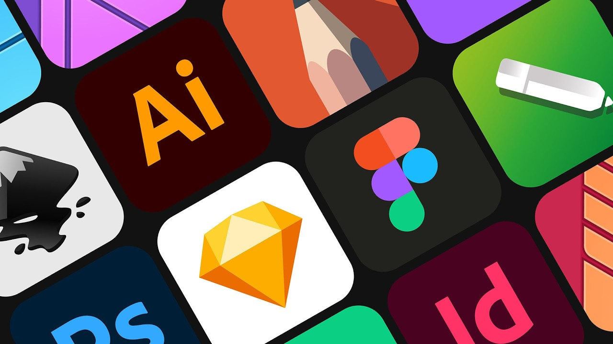
---

### 🎨 Los Fundamentos del Diseño que Debes Conocer Antes de Abrir Illustrator

Antes de abrir el programa, es clave entender los principios básicos del diseño. Estos son como las reglas de gramática para un escritor: sin ellos, tu mensaje puede perderse.

#### 1. **Composición y Diagramación**
- ¿Qué es? Es cómo organizas los elementos en tu diseño: textos, imágenes, formas, etc.
- ¿Por qué importa? Una buena composición guía la mirada del espectador y comunica tu mensaje de manera clara.
- Ejemplo práctico: Piensa en una revista. Si todo está amontonado, nadie querrá leerla. En Illustrator, usarás guías, rejillas y alineaciones para ordenar tus elementos.

#### 2. **Teoría del Color**
- ¿Qué es? La ciencia y el arte de cómo usamos los colores.
- ¿Por qué importa? Los colores transmiten emociones. El azul puede dar tranquilidad, el rojo, urgencia o pasión.
- En Illustrator: Aprenderás a usar la rueda de color, crear paletas armoniosas y aplicar gradientes para dar vida a tus diseños.

#### 3. **Tipografía**
- ¿Qué es? El arte de elegir y combinar fuentes (letras).
- ¿Por qué importa? La tipografía puede hacer que un texto sea fácil o difícil de leer, y también puede reforzar el mensaje (ejemplo: una fuente elegante para una boda, una fuente moderna para un evento tecnológico).
- En Illustrator: Aprenderás a manipular texto, ajustar interlineados, espaciado y convertir texto en formas para crear logotipos únicos.

---

### 🛠️ Herramientas: Illustrator y Alternativas Gratuitas

#### Adobe Illustrator: Tu Nuevo Taller de Creación
- **¿Por qué usarlo?** Es la herramienta profesional por excelencia. Te permite crear desde logotipos hasta ilustraciones complejas.
- **Conceptos clave que dominarás:**
  - **Capas:** Como hojas transparentes que te ayudan a organizar tu trabajo.
  - **Herramienta Pluma:** Para crear trazados y formas personalizadas.
  - **Pathfinder:** Para unir, dividir o recortar formas.
  - **Mallas de degradado:** Para dar profundidad y realismo a tus ilustraciones.

#### Herramientas Virtuales Gratuitas
Si no tienes acceso a Illustrator aún, no te preocupes. Hay opciones como:
- **Inkscape:** Similar a Illustrator, pero gratuito y de código abierto.

- **Canva:** Ideal para diseños rápidos y con plantillas predefinidas.
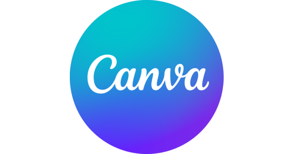

- **Figma:** Muy usado para diseño de interfaces, pero también para vectoriales.

---

### 🌟 3D, Animación e Inteligencia Artificial en el Diseño

El diseño ya no es solo estático. Illustrator se ha modernizado y ahora integra funciones de 3D y colabora con otras herramientas para animación e IA.

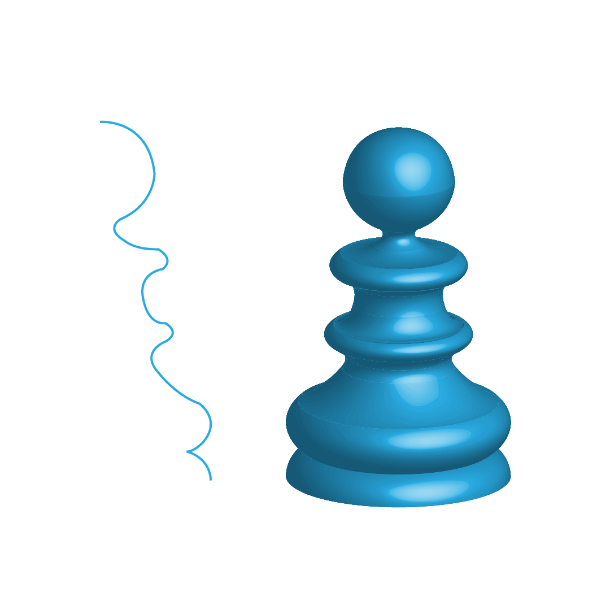

#### Diseño 3D en Illustrator
- Puedes convertir formas planas en objetos 3D con efectos como *Extrusión y Bisel*.
- Ideal para crear empaques, iconos con volumen o ilustraciones con profundidad.

#### Animación
- Aunque Illustrator no anima directamente, puedes diseñar los elementos aquí y luego llevarlos a After Effects o Adobe Animate para darles movimiento.

#### Inteligencia Artificial
- Illustrator ya incluye funciones impulsadas por IA, como **recolorar artwork automáticamente** o generar paletas de colores inteligentes.
- También existen herramientas externas que generan vectores a partir de bocetos o descripciones textuales.

---

### ✍️ Creando tu Primera Pieza Gráfica de Alto Impacto

Imagina que quieres diseñar un cartel para un evento. Sigue estos pasos:

1. **Desarrollo del Concepto**
   - Piensa en el mensaje clave. ¿Es un evento musical? Usa colores vibrantes y tipografía dinámica.
   - Haz bocetos en papel antes de abrir Illustrator.

2. **Aplicación de Técnicas Visuales**
   - Crea una paleta de colores coherente.
   - Usa jerarquía tipográfica: un título grande, subtítulo más pequeño y texto descriptivo aún menor.

3. **Integración de Herramientas**
   - Diseña los elementos principales en Illustrator.
   - Si necesites texturas o imágenes, puedes usar Photoshop o herramientas gratuitas como Unsplash para fotos de fondo.

4. **Exportación**
   - Guarda tu diseño en formatos adecuados: PDF para imprimir, PNG para web.

---

### 🔮 Un Vistazo al Futuro del Diseño con Illustrator

El diseño gráfico está en constante evolución. Illustrator sigue integrando nuevas tecnologías, como:
- **Colaboración en la nube:** Trabaja en equipo desde cualquier lugar.
- **Integración con realidad aumentada:** Diseña gráficos que cobran vida en el mundo real.
- **Automatización con scripts y plugins:** Ahorra tiempo en tareas repetitivas.

---

>*Creado con pasión por un diseñador gráfico que también empezó desde cero.*

### ✅  Tu Camino Acaba de Empezar

Aprender diseño gráfico con Illustrator es como aprender un superpoder: te permite dar forma a tus ideas y comunicar visualmente lo que las palabras a veces no pueden. No te rindas si al principio te sientes abrumado. Practica, experimenta y, sobre todo, diviértete creando.

¿Listo para empezar? Abre Illustrator, dibuja tu primera forma, juega con los colores y tipografías… y verás cómo poco a poco irás creando piezas que ni tú mismo imaginabas.

¡El diseño te espera! 🎨✨

---

## **¿Qué es Realmente el Diseño? Más Allá de lo "Bonito"**

Si tuviera que resumir el diseño en una sola idea, usaría la poderosa frase del gran Charles Eames: **"Un plan para colocar elementos de la mejor manera y así lograr un propósito en particular"**. Fíjate bien en las palabras clave: *plan, mejor manera, propósito*. Esto nos da la primera gran pista: el diseño es, ante todo, **estrategia**.

#### **El Diseño como Solucionador de Problemas**

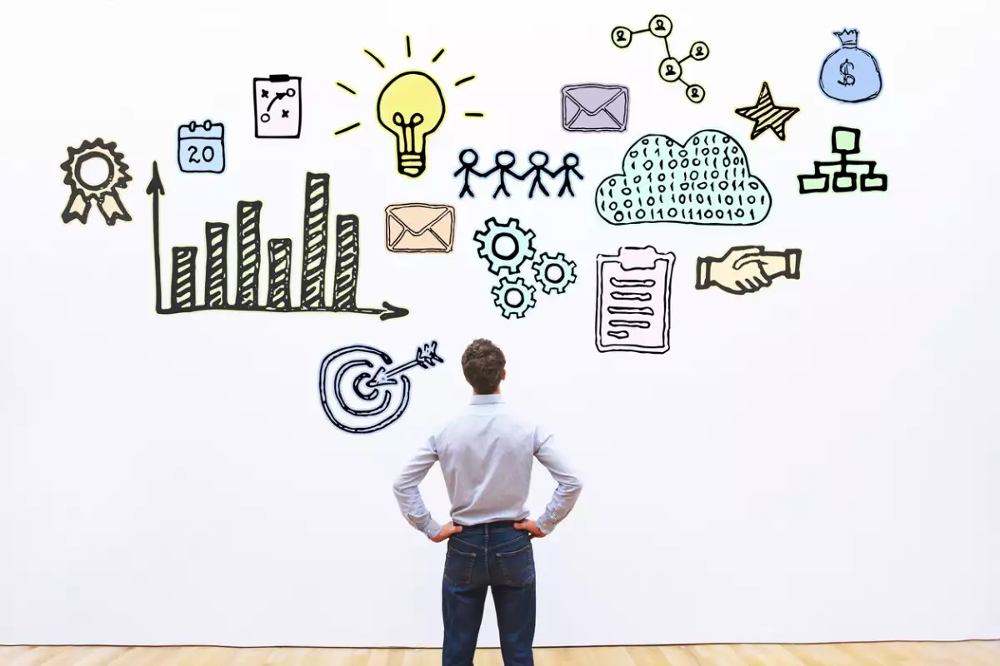

A diferencia de lo que muchos creen al inicio, el diseño no se trata principalmente de hacer las cosas "lindas". Su corazón late por la **funcionalidad**. Piensa en estos ejemplos:

*   Una **señal de salida de emergencia** no se diseña para que sea decorativa, sino para que sea entendida instantáneamente, incluso en medio del pánico. Su color, icono y tipografía tienen la función de salvar vidas.
*   La **aplicación de tu banco** no busca ser una obra de arte abstracto, sino permitirte transferir dinero de forma clara, segura y eficiente.

El diseño nace de una **necesidad específica** y se orienta siempre a un **público o usuario**. Mientras que un artista puede crear para sí mismo, un diseñador crea para otros. Nuestro trabajo está determinado por las preferencias, limitaciones y contexto de quienes usarán nuestro producto.

---

### **El Gran Debate: ¿Diseño o Arte?**

Este es un tema fascinante y, tras años en el oficio, me alineo con una postura muy clara: **el diseño no es arte**. Y esto no es para menospreciarlo, ¡todo lo contrario! Es para entender su poder único.

Imagínatelo así:

| **El ARTE...**                                                               | **El DISEÑO...**                                                             |
| ---------------------------------------------------------------------------- | ---------------------------------------------------------------------------- |
| **Plantea Preguntas** y explora emociones.                                   | **Da Respuestas** y soluciona problemas.                                     |
| Su interpretación es **subjetiva** y personal.                               | Su éxito se mide de forma **objetiva** (¿cumple su función?).                |
| Es **expresión personal** sin restricciones funcionales.                     | Está **sujeto a restricciones** como presupuesto, tiempo y usabilidad. |
| Su proceso puede ser **intuitivo y libre**.                                  | Sigue un **proceso metódico** (investigación, análisis, iteración).          |

**Un ejemplo práctico: La Felicidad**

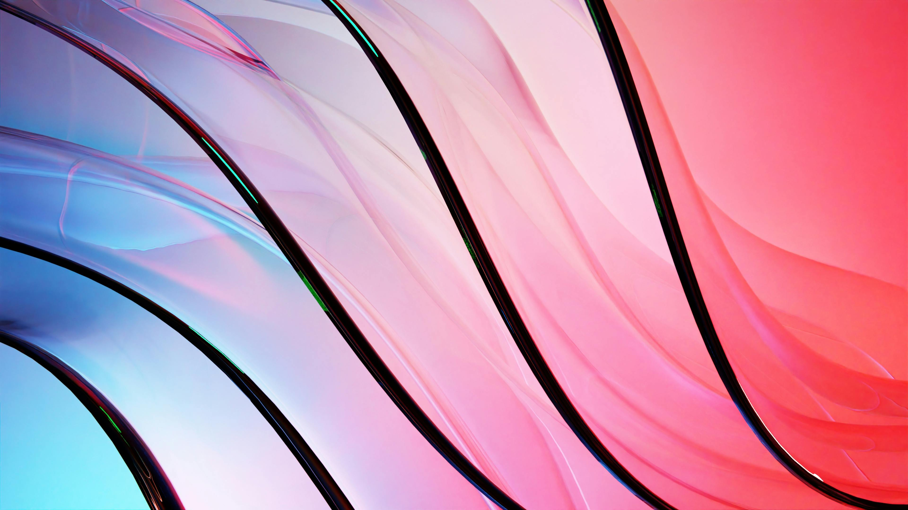

*   **Como artista:** Pintarías un cuadro abstracto lleno de colores vibrantes que, para ti, expresan felicidad. Un espectador podría ver tristeza en ello, y está bien. El arte es así.
*   **Como diseñador:** Crearías el flujo de una app de meditación que, a través de una tipografía calmada, iconos intuitivos y sonidos relajantes, **genera de manera confiable una sensación de tranquilidad y bienestar en el usuario**. El resultado debe ser consistente, no abierto a múltiples interpretaciones.

El arte nutre nuestra sensibilidad y alimenta la creatividad del diseñador, pero no determina nuestras decisiones. Nuestras elecciones se rigen por **principios, normas, parámetros técnicos y la necesidad del usuario.**

Como dijo el diseñador Vico Magistretti: *"El mejor piropo que se me puede decir es que un diseño mío parece tan simple que hubiera podido hacerlo cualquiera"*. Esa simplicidad aparente es el resultado de un complejo proceso de eliminación, refinamiento y ajuste para lograr la solución más eficaz.

---

### **Las Múltiples Caras del Diseño: No Solo es Gráfico**

Cuando piensas en "diseño", tu mente puede ir primero a un logo o un póster. Pero el campo es inmenso y mejora casi every aspecto de nuestra vida:

*   **Diseño Arquitectónico:** Crea espacios donde vivimos y trabajamos, buscando eficiencia, seguridad y bienestar.
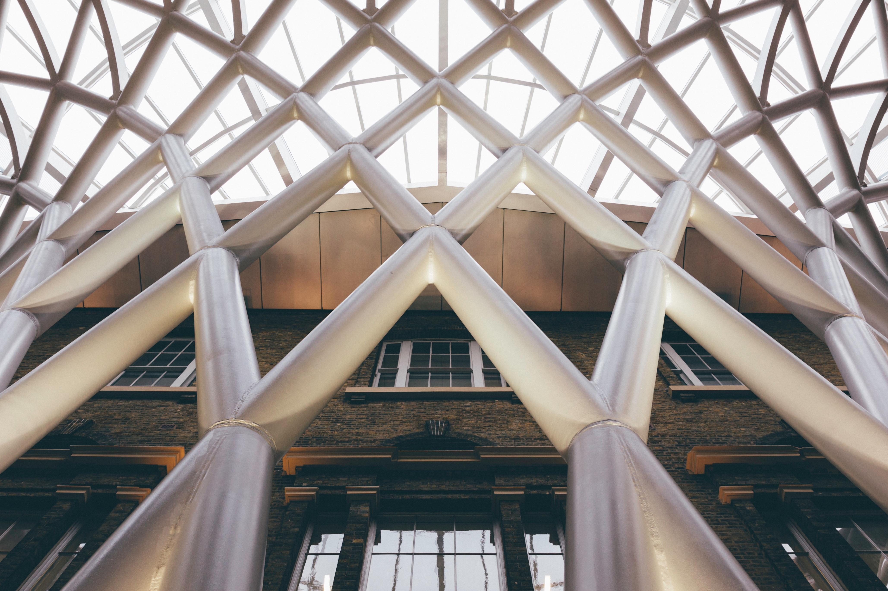

*   **Diseño Editorial:** Organiza texto e imagen en libros y revistas para que la lectura sea una experiencia placentera y clara.
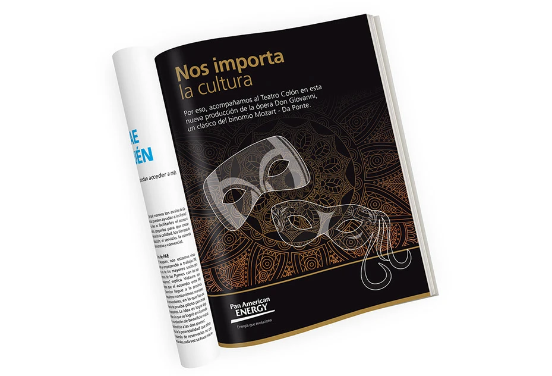

*   **Diseño Publicitario:** Construye mensajes visuales que captan la atención y comunican una idea comercial de forma memorable.
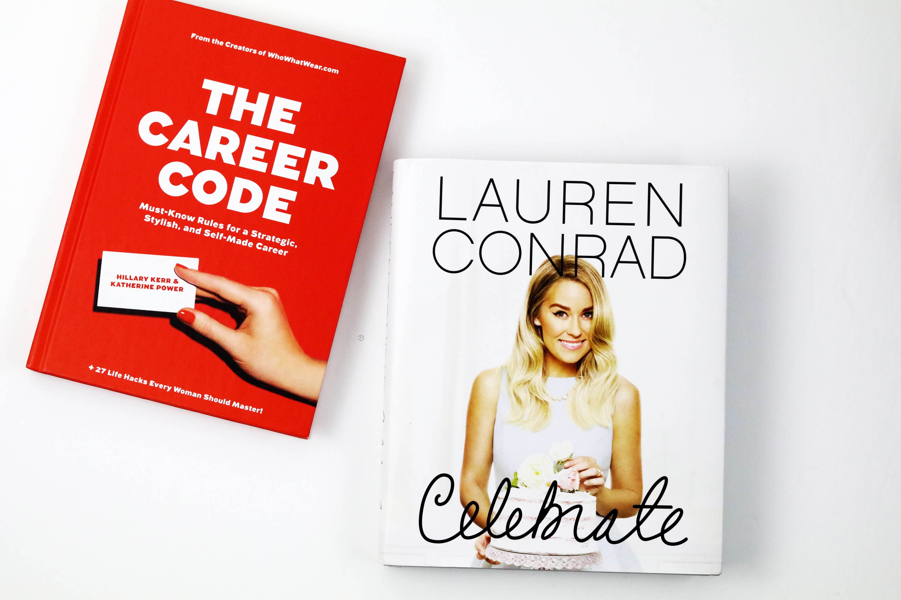

*   **Diseño de Producto:** Da forma a tu silla, tu teléfono o tu auto, equilibrando ergonomía, materiales y estética.
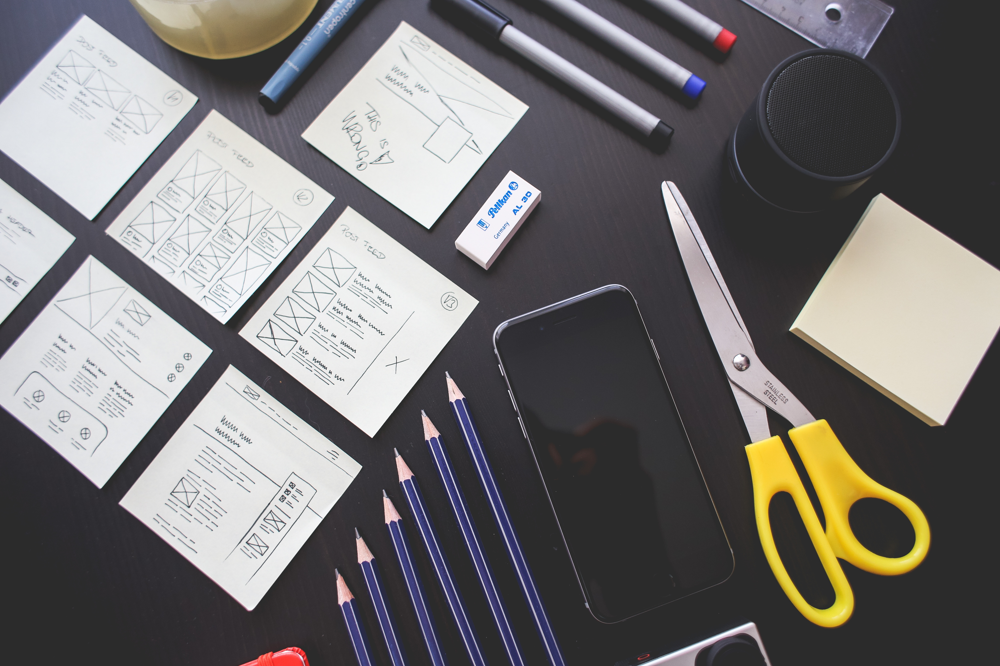   

*   **Diseño de Experiencia (UX):** Se enfoca en cómo te sientes al interactuar con un sitio web o una app, haciendo que el proceso sea intuitivo y satisfactorio.
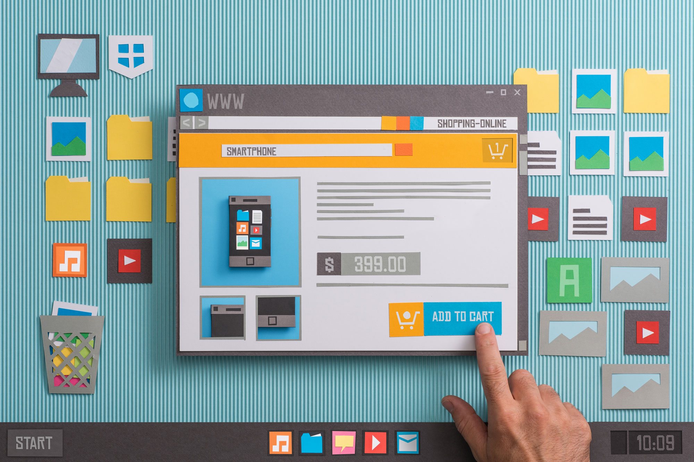

Cada una de estas ramas comparte la misma esencia: **resolver una problemática humana específica a través de una solución creativa y funcional.**

---

### **Las Habilidades Clave de un Verdadero Diseñador**

Para navegar este mundo, no basta con tener "buen gusto". Se necesita un conjunto de habilidades concretas:

1.  **Observación Aguda:** Ser como un detective, capaz de identificar problemas y necesidades que otros pasan por alto.
2.  **Análisis Crítico:** Generar múltiples ideas y evaluar cuál es la solución óptima, descartando lo que no funciona.
3.  **Planificación Metódica:** Organizar el proceso de trabajo. En Illustrator, esto se traduce en usar capas, estilos gráficos y bibliotecas de manera ordenada para ser eficiente.
4.  **Ejecución Impecable:** Llevar la idea al resultado final. Aquí es donde dominar herramientas como Illustrator se vuelve crucial, para producir un trabajo que no solo es estéticamente agradable, sino técnicamente pulcro y listo para su uso.

---
**La Belleza está en la Función**

>**La verdadera belleza en el diseño no es un adorno; es el resultado de una función cumplida a la perfección.**

El diseño es, en esencia, un oficio de servicio. Es una disciplina que requiere tanto de la creatividad como del pensamiento lógico. La próxima vez que admires un cartel, uses una app sin frustrarte o te sientes en una silla cómoda, piensa en todo el proceso de resolución de problemas que hay detrás.

---

## **Diseño Universal y Atemporal**

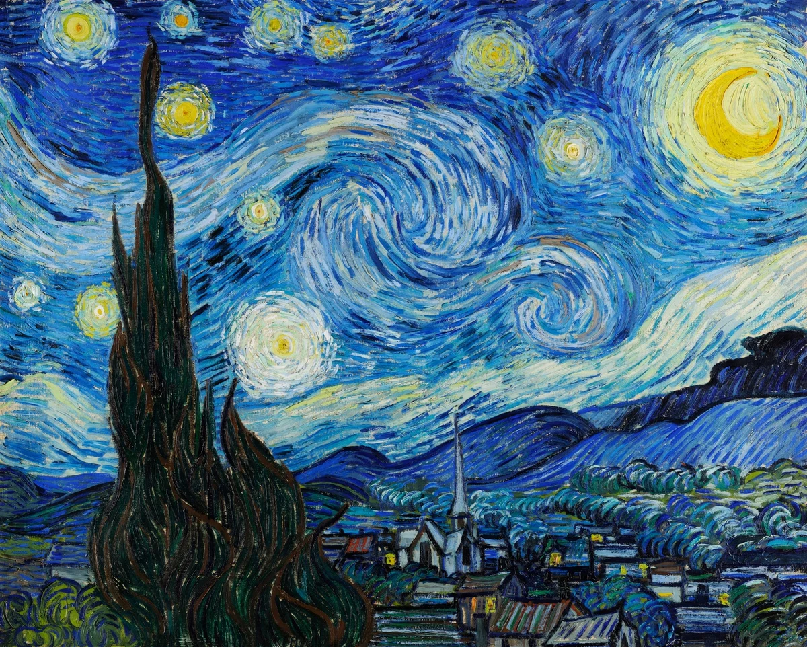

Desde que somos niños, estamos diseñando. ¿Recuerdas cuando dibujabas un carro con cuatro ruedas y un rectángulo, y todos entendían que era un carro? Ese es el poder del **diseño universal**: la capacidad de comunicar una idea compleja con la máxima simplicidad, trascendiendo barreras idiomáticas, culturales y educativas.

#### **¿Qué es Realmente el Diseño Universal?**

El diseño universal es la creación de productos, entornos y, sobre todo, comunicaciones visuales, que son accesibles y comprensibles para la mayor cantidad de personas posible, sin necesidad de adaptaciones o explicaciones adicionales.

**Su objetivo es eliminar barreras.** Piensa en estos ejemplos contundentes:

*   **La señal de "PARE":** Ya sea en Colombia, Japón o Egipto, su forma octagonal y color rojo transmiten la misma orden imperativa: "Detente".
*   **Un corazón:** No necesitas palabras para saber que representa el amor o un "me gusta". Es universal.
*   **El icono de una lupa:** En cualquier sitio web o app, todos entendemos que al hacer clic podremos "buscar".

Como diseñadores, nuestro trabajo no es decorar, sino **codificar información en formas visuales que el cerebro pueda decodificar instantáneamente.**

#### **La Búsqueda de la Atemporalidad: Cuando el Diseño Trasciende las Modas**

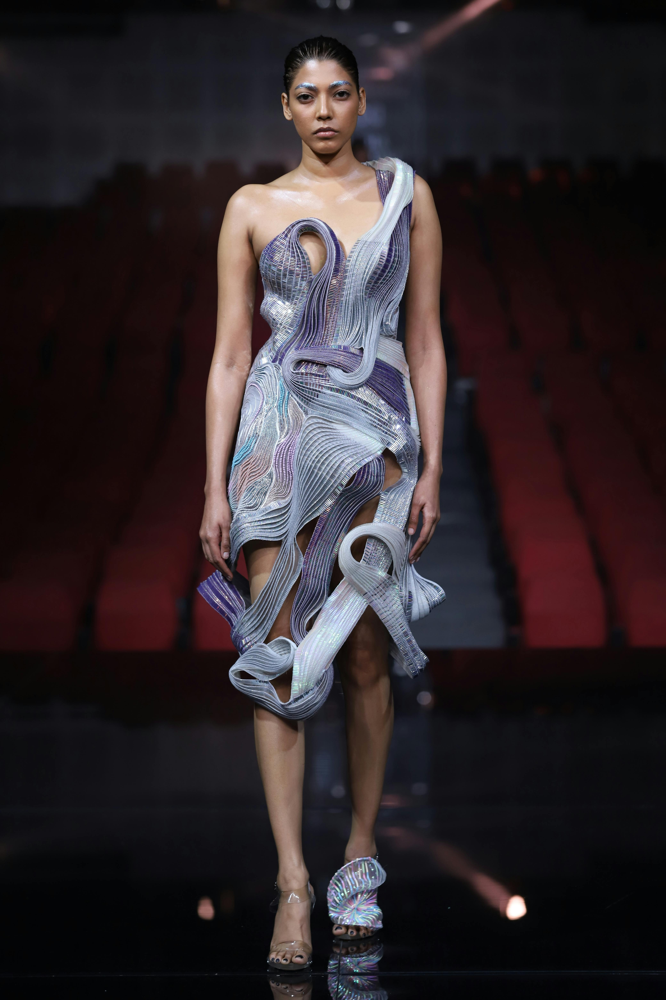

Junto a la universalidad, está el concepto de **diseño atemporal**. Este es un diseño que no se ve esclavizado por las tendencias pasajeras. Su esencia es tan sólida que permanece relevante y comprensible a lo largo de los años, incluso décadas.

**¿Cómo se logra la atemporalidad?**

1.  **Simplicidad Radical:** "Menos es más" no es solo un cliché; es una ley de supervivencia visual. Un diseño simple, libre de elementos superfluos, tiene más probabilidades de perdurar. Piensa en los logos de Nike o Apple. Son tan simples que son imposibles de olvidar.
2.  **Consistencia en la Esencia:** Una marca puede modernizarse, pero su concepto central permanece. La manzana de Apple ha evolucionado, pero nunca ha dejado de ser una manzana.
3.  **Enfoque en el Concepto, No en la Decoración:** Si el concepto es fuerte (un avión representa viaje), la forma puede simplificarse al extremo y el mensaje seguirá intacto. Un tren siempre será un vehículo que se desplaza sobre rieles, sin importar si es de vapor o eléctrico.

En Illustrator, esto se traduce en usar formas básicas, trazos limpios y una paleta de colores deliberada. Evitar efectos de moda (como ciertos degradados complejos o sombras exageradas) que harán que tu diseño parezca obsoleto en un par de años.

---

### **Cómo Implementar el Diseño Universal en Tus Proyectos con Illustrator**

Ahora, ¿cómo llevamos esta teoría a la práctica en nuestro espacio de trabajo en Illustrator?

**1. Sintetiza hasta la Esencia Misma:**
*   **Ejercicio:** Toma un objeto complejo, como un avión despegando. Tu misión no es dibujar cada detalle, sino reducirlo a su forma más básica y reconocible. ¿Cuántas líneas necesitas para que cualquiera entienda la idea de "despegue"? Probablemente una o dos. Usa la **Herramienta Pluma** y las **Formas Básicas** para crear estas siluetas puras.

**2. Crea un Sistema, no solo Iconos Sueltos:**
*   La señalética es el ejemplo perfecto. Todas las señales de un aeropuerto comparten un mismo lenguaje visual: mismos grosores de línea, misma paleta de colores, misma familia tipográfica.
*   **En Illustrator:** Utiliza **Estilos Gráficos** y **Símbolos**. Si defines un estilo de línea para tus iconos, aplícalo consistentemente. Esto crea coherencia y universalidad dentro de tu propio proyecto.

**3. Piensa en la Escalabilidad:**
*   Un diseño universal debe funcionar en una valla publicitaria y en el favicon de una web (esa pequeña imagen en la pestaña del navegador).
*   **Trabaja en Vector:** Esta es la gran ventaja de Illustrator. Tus diseños, al ser vectores, no pierden calidad al escalarse. Un icono debe seguir siendo claro y legible incluso a 16x16 píxeles.

**4. La Tipografía como Aliada (o Enemiga):**
*   Para maximizar la universalidad y legibilidad, prioriza tipografías limpias, sans-serif y de alto contraste. Evita tipografías demasiado decorativas que puedan dificultar la lectura rápida o que no se reproduzcan bien en tamaños pequeños.

---

### **La Conexión con la Inteligencia Artificial y el Futuro**

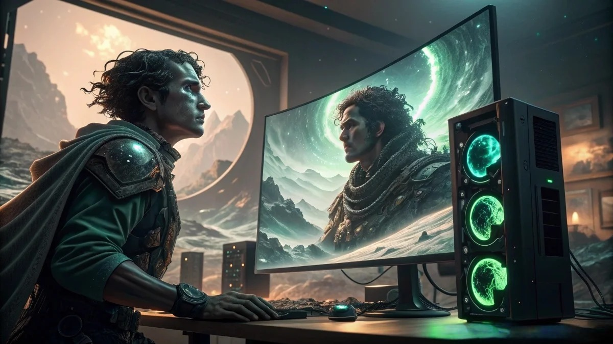

Hoy, estos principios son más relevantes que nunca. Las interfaces de voz, los asistentes de IA y la realidad aumentada dependen de un lenguaje visual universal e inmediato. Cuando le pides a un asistente de IA que "muestre el clima", este representa "sol" con un icono simple y universal, no con una pintura impresionista de un paisaje.

El diseño universal es el puente que permite a los humanos y a las máquinas entenderse visualmente.

### **Tu Rol como Diseñador Universal**

Como creadores, nuestra responsabilidad va más allá de satisfacer un gusto personal. Somos traductores de información en experiencia visual. Al dominar el diseño universal y atemporal, dejas de ser solo alguien que "sabe usar Illustrator" y te conviertes en un estratega de la comunicación, capaz de crear trabajos que no solo son hermosos, sino que son **útil, inclusivo y duradero.**

La próxima vez que estés frente a una mesa de trabajo en Illustrator, pregúntate: *¿Podría alguien en cualquier parte del mundo, sin importar su edad o idioma, entender instantáneamente lo que quiero comunicar?* Si la respuesta es sí, vas por el camino correcto.

¡Sigue simplificando, sigue creando!

---

## **El Arte de Generar Ideas**

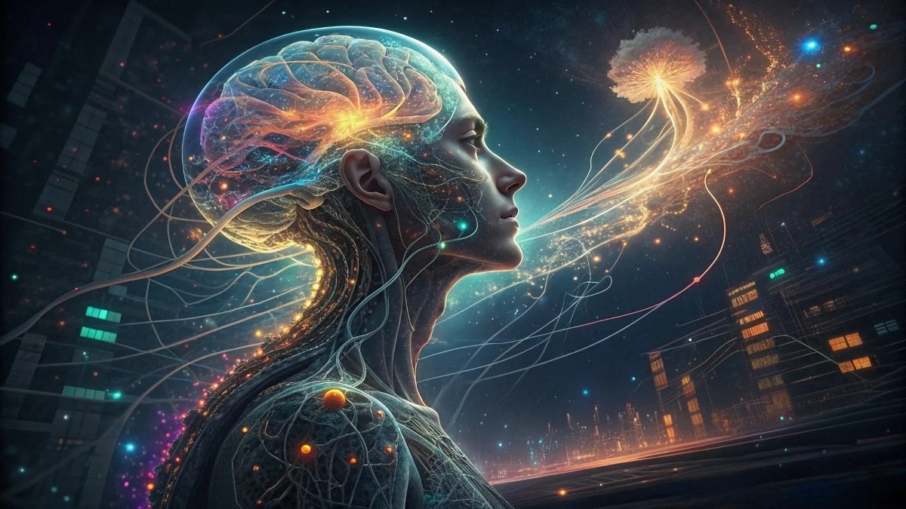

La creatividad no es un don mágico que solo poseen algunos iluminados. Es un **proceso**, una disciplina. Y como todo proceso, tiene métodos, herramientas y puntos de partida. Aquí es donde dejamos de esperar a que "llegue la musa" y empezamos a construir ideas con nuestras propias manos.

#### **1. La Lección de Da Vinci: Bocetar es Pensar**

El boceto del helicóptero de Leonardo Da Vinci es el ejemplo perfecto. En su época, era poco más que un sueño en papel. Hoy, es la base de una tecnología esencial. Esto nos enseña dos cosas fundamentales:

*   **Ninguna idea es demasiado descabellada.** La semilla de un gran diseño puede parecer una simple curiosidad al principio.
*   **El boceto es el lenguaje nativo del diseñador.** Es la forma más rápida y directa de materializar un pensamiento. En Illustrator, esto se traduce en usar la **Herramienta Pincel** o el **Lápiz** para hacer lluvias de ideas visuales sin el pressure de la perfección. ¡Deja que tu mano sea libre!

#### **2. Tus Fuentes de Inspiración Digital: Más Allá de Google**

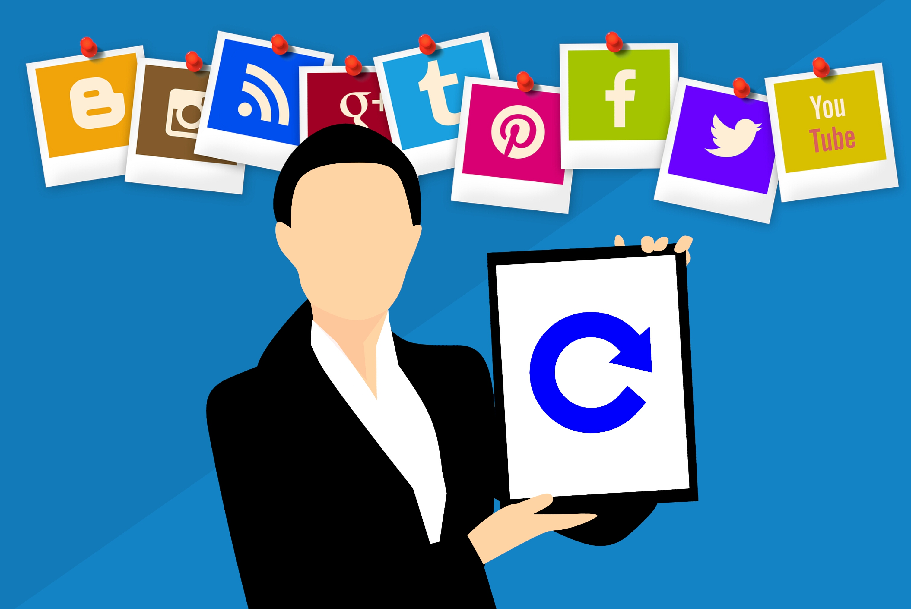

Para generar ideas nuevas, necesitas alimentar tu cerebro con ideas existentes. Pero no se trata de copiar, sino de **conectar puntos**.

*   **Behance:** Tu galería de arte profesional. Ideal para ver proyectos terminados y entender procesos de otros diseñadores. No solo mires el resultado final; revisa los *caso de estudio* para entender *cómo* llegaron allí.
*   **Pinterest:** Tu tablón de inspiración universal. Aquí la clave es la **organización**. Crea tableros específicos: "Tipografía vintage", "Paletas de colores para branding ecológico", "Composición para posters". Cuando tengas un proyecto, acude a tus tableros y verás patrones e ideas que resuenan contigo.
*   **Dribbble:** Perfecto para ver tendencias en UI/UX y gráficos en dosis rápidas y visuales.

**Mi flujo de trabajo con Pinterest y Illustrator:**
1.  Creo un tablero secreto para un proyecto específico.
2.  Pino todo lo que me genere una reacción, aunque no sepa por qué.
3.  Identifico patrones comunes (colores, estilos, composiciones).
4.  Abro Illustrator y empiezo a bocetar basándome en esos patrones, no en imágenes específicas. La inspiración se digiere, no se copia.

#### **3. Técnicas Probadas para Desbloquear tu Creatividad**

Cuando te sientas atascado, estas metodologías pueden ser tu salvavidas:

*   **Brainstorming (Lluvia de Ideas):** La clave es **no juzgar**. En una pizarra o un documento, escribe o dibuja TODO lo que se te ocurra, aunque sea absurdo. La idea "mala" puede ser el puente a la idea brillante.

*   **Mapas Mentales:** Toma tu concepto central (ej: "Deporte") y colócalo en el medio de la página. Luego, dibuja ramas con palabras asociadas ("velocidad", "sudor", "victoria", "comunidad"). De cada una, saca más ramas. Verás cómo un concepto simple se expande en direcciones inesperadas.
*   **Analogías y Metáforas:** ¿Tu cliente es un banco y necesitas una idea fresca? Piensa: "Si este banco fuera un animal, ¿cuál sería?" (Un águila: visión; una hormiga: trabajo en equipo). Esta abstracción ayuda a encontrar conceptos visuales poderosos.
*   **Restricciones Creativas:** Paradoxalmente, los límites liberan. Impón reglas: "Diseñaré este logo usando solo formas geométricas básicas" o "Tengo 30 minutos para generar 10 ideas". Esto obliga a tu cerebro a encontrar soluciones ingeniosas.

#### **4. El "Board de Diseño": Tu Mapa de Ruta Visual**

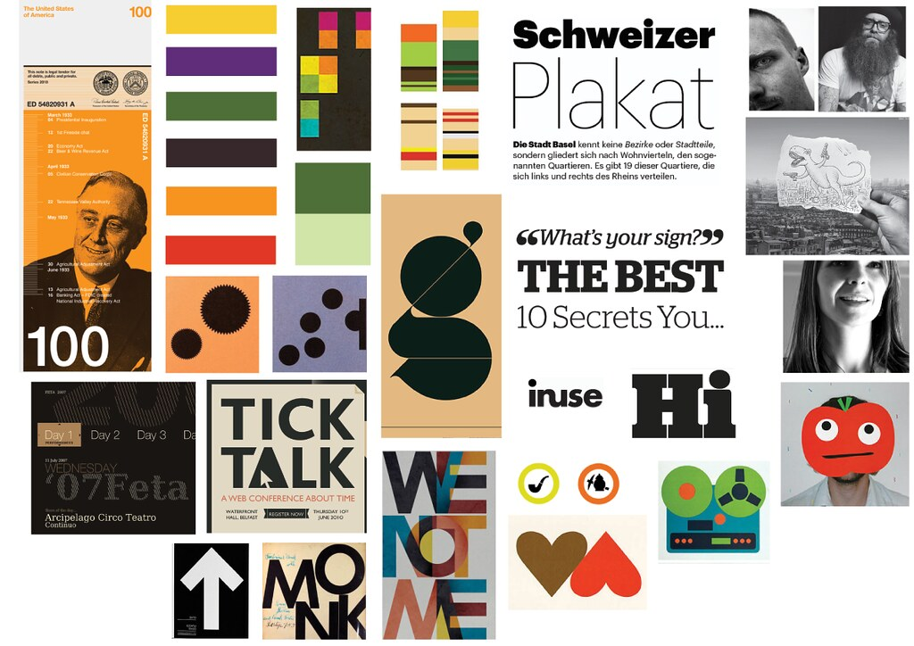

Un "Moodboard" o board de diseño no es un collage bonito. Es la **herramienta estratégica** más importante antes de abrir Illustrator. Sirve para:

*   **Definir el Estilo Visual:** Aquí es donde unificas paletas de color, tipografías y estilos de imagen.
*   **Sintetizar la Investigación:** Reúnes toda la inspiración dispersa en un solo lugar coherente.
*   **Alinear Expectativas:** Es la referencia objetiva que evita el "no me gusta, sin saber por qué" del cliente o de ti mismo.

**Cómo crearlo en Illustrator:** Crea un tablero de arte grande y ve colocando screenshots, paletas de color (usando la herramienta **Cuentagotas**), muestras de tipografía y tus propios bocetos escaneados. Es tu entorno de pruebas visual.

#### **5. Alimenta tu Mente Fuera de lo Digital**

La inspiración más pura no está en una pantalla. Está en:

*   **Documentales:** Como **Abstract** en Netflix, que te muestra la mente de diseñadores icónicos como Paula Scher (tipografía) o **The Creative Brain**, que explora la neurociencia de la creatividad.
*   **Libros:** **"Roba como un artista"** de Austin Kleon es una biblia. Su premisa es que nada es original, sino que la creatividad viene de la combinación única de tus influencias. ¡Aprovéchalo!
*   **El Mundo Real:** Observa la arquitectura, los carteles en la calle, la forma de las hojas de los árboles, el color del atardecer. Lleva siempre un cuaderno de bocetos o usa tu teléfono para fotografiar texturas y composiciones que te llamen la atención.

### **Conviértete en un Cazador de Ideas**

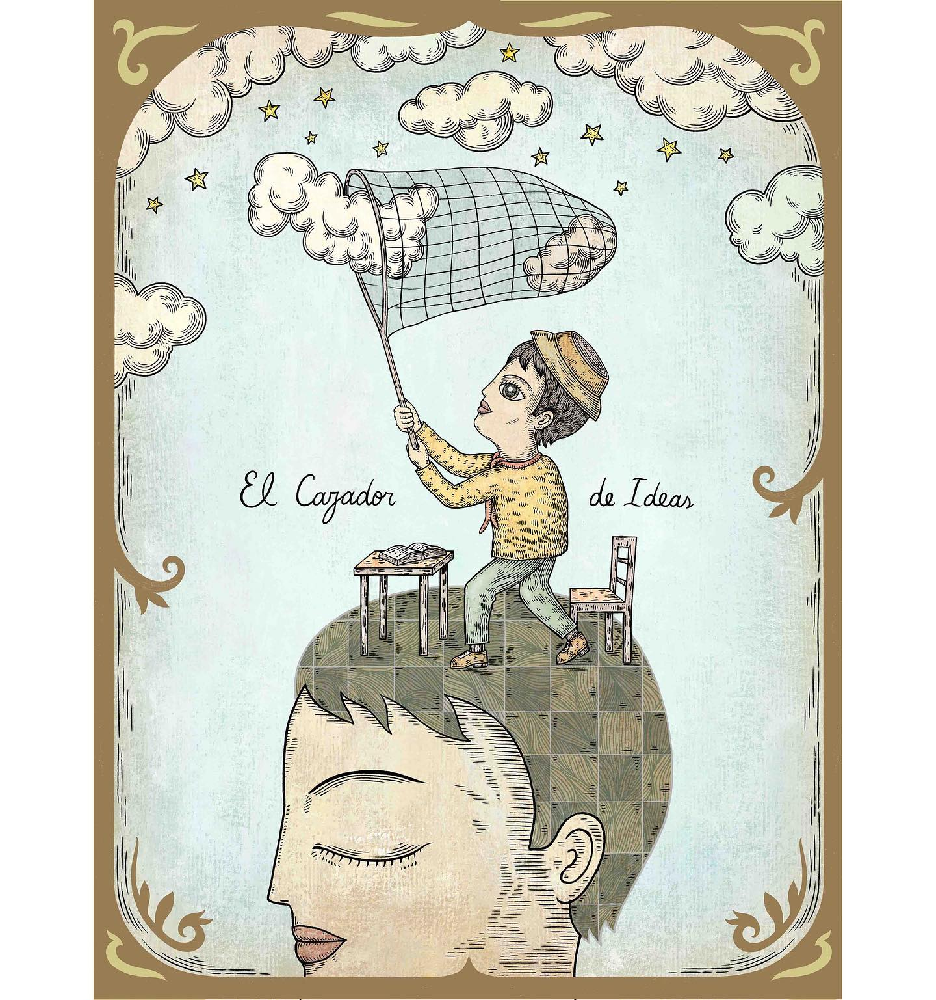

Generar ideas no es un evento, es un estilo de vida. Es mantener la curiosidad siempre encendida, tener la humildad de inspirarte en los demás y la disciplina de sentarte a bocetar, incluso cuando no apetece.

La próxima vez que te enfrentes a un proyecto en Illustrator, no corras a abrir el programa de inmediato. Tómate tu tiempo. Investiga, boceta en papel, crea tu board de diseño. Verás cómo cuando finalmente te sientes frente a la pantalla, tendrás un camino claro por delante y las ideas fluirán con mucha más facilidad y propósito.

**Recuerda: No se trata de crear desde la nada, se trata de conectar lo que ya existe de una manera que solo tú puedes hacer.** ¡Ahora ve y llena esos tableros de arte!

---

## **De la Idea al Proyecto: Cómo Definir y Desarrollar tu Primer Diseño Profesional**

Llegó el momento. Has aprendido los fundamentos, has explorado la inspiración y ahora toca aplicar todo ese conocimiento en un **proyecto final**. Este no es un ejercicio más; es el puente entre ser un aprendiz y convertirte en un creador con criterio. Como diseñador que ha guiado decenas de proyectos, te diré que esta etapa es donde realmente descubres qué significa ser diseñador.

#### **El Propósito Real de un Proyecto de Diseño**

Antes de abrir Illustrator, debes tener claro el *porqué*. Un proyecto de diseño no es un capricho estético. Es una **pieza de comunicación estratégica** que debe ser:

*   **Universal:** Comprensible para tu audiencia objetivo.
*   **Funcional:** Cumplir un propósito claro para el usuario.
*   **Atemporal:** Mantener su esencia más allá de las tendencias pasajeras.

Recuerda las palabras de Charles Eames: "Un plan para colocar elementos de la mejor manera y así lograr un propósito particular". Tu proyecto final es ese plan llevado a su máxima expresión.

---

### **El Punto de Partida: Elegir un Tema con Alma**

La elección del tema es el cimiento de todo. No elijas algo que "suene bien"; elige algo que **te late rápido**. La pasión es el combustible que te mantendrá motivated durante las largas horas de trabajo.

**Ejemplo práctico: ¿Por qué la NBA funciona como tema?**
- **Color:** Tiene paletas vibrantes y emocionales
- **Tipografía:** Letras bold que comunican fuerza y movimiento
- **Fotografía:** Imágenes llenas de acción y expresión
- **Conceptos:** Innovación, competencia, trabajo en equipo

**Cómo encontrar tu tema ideal:**
1. **Haz una lista de tus intereses:** Música, deportes, tecnología, moda...
2. **Pregúntate:** ¿De qué podría hablar horas? ¿Qué me hace perder la noción del tiempo?
3. **Investiga visualmente:** ¿Hay suficiente material de referencia?

---

### **La Fase de Investigación: Tu Kit de Supervivencia Creativa**

Una vez elegido el tema, viene mi parte favorita: la **caza de inspiración**. Esto no es copiar; es entender el lenguaje visual de tu tema.

**Tu arsenal de investigación:**

**Pinterest - El Tesoro Visual:**
- Crea tableros específicos: "Colores NBA", "Tipografía deportiva", "Composición dinámica"
- Usa palabras clave concretas: "basketball vintage posters", "sports branding"
- **Pro-tip:** No solo guardes lo "bonito"; guarda lo que te genere una reacción, aunque no sepas por qué

**Behance - La Masterclass Gratuita:**
- Analiza proyectos completos de otros diseñadores
- Fíjate en su proceso: bocetos, evolución, decisiones finales
- **Ejercicio:** Elige 3 proyectos que te impacten y anota QUÉ específicamente te gusta de cada uno

**Mi Flujo Personal en Illustrator:**
1. Abro un documento nuevo solo para referencias
2. Capturo pantallas de lo más inspirador
3. Uso la herramienta **Cuentagotas** para extraer paletas de colores
4. Creo muestras de tipografías que veo recurrentemente

---

### **Definiendo el Alcance: ¿Qué Vas a Crear Exactamente?**

Un error común de principiantes: querer abarcar demasiado. Es mejor hacer **pocas piezas bien resueltas** que muchas mediocres.

**Posibles piezas para tu proyecto:**
- Un sistema de logo + aplicaciones
- Un póster principal + variaciones
- Una serie de 3 gráficas para redes sociales
- Un manual de marca básico

**Ejemplo para tema NBA:**
- Logo de un equipo ficticio
- Póster de temporada
- Diseño de camiseta
- Tarjeta de identidad visual

---

### **Preparándote para la Composición: Los Cimientos Visuales**

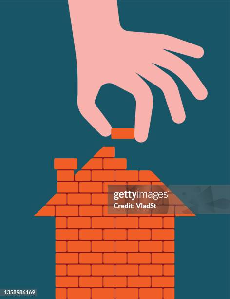

Antes de pasar al módulo de composición, necesitas tener claro estos elementos:

**Tu Paleta de Color:**
- 1-2 colores principales
- 2-3 colores secundarios
- 1 color de acento

**Tu Familia Tipográfica:**
- 1 fuente para headlines (puede ser más expresiva)
- 1 fuente para body copy (debe ser legible)
- **En Illustrator:** Usa **Estilos de Carácter** para mantener consistencia

**Tu Librería de Elementos:**
- Iconos personalizados
- Formas recurrentes
- Texturas o patrones

---

### **El Mindset Correcto para el Proyecto Final**

**Esto NO es arte personal:** Cada decisión debe justificarse. ¿Por qué ese color? ¿Por qué esa tipografía? ¿Resuelve un problema de comunicación?

**SÍ es expresión profesional:** Tu personalidad sale en cómo resuelves problemas, no en decorar sin sentido.

**Recuerda:** El mejor cumplido que puedes recibir es que tu diseño "parece tan simple que cualquiera pudo hacerlo". Esa simplicidad es el resultado de horas de refinamiento y decisiones conscientes.

---

### **Próximos Pasos: De la Teoría a la Práctica**

En el siguiente módulo nos sumergiremos en la **composición** propiamente dicha. Aprenderemos:
- Las leyes del equilibrio y la jerarquía visual
- Cómo crear flujos de lectura naturales
- Técnicas específicas de Illustrator para composiciones efectivas

Mientras tanto, tu misión es:
1. **Elegir tu tema** con el corazón y la cabeza
2. **Investigar como detective** en Pinterest y Behance
3. **Definir el alcance** de tu proyecto
4. **Empezar a recopilar** tus elementos base

**Un último consejo de veterano:** Guarda todas tus versiones. Crea una carpeta "Proceso" donde guardes cada iteración. Ver la evolución de tu proyecto te dará perspectiva y confianza.

¿Listo para dar vida a tu primera gran pieza de diseño? El viaje comienza con una decisión: ¿sobre qué vas a crear? ¡El tema perfecto te está esperando!

---

## **Composición Visual**

La composición visual representa uno de los pilares más fundamentales y fascinantes del diseño. Como diseñador con años de experiencia, puedo afirmar que comprender la composición fue lo que transformó mi trabajo de "agradable" a "profesionalmente efectivo". Esta disciplina va mucho más allá de simplemente "acomodar elementos bonitos" - se trata de **dirigir intencionalmente la mirada y la experiencia del espectador**.

#### **¿Qué Es Realmente la Composición Visual?**

La composición es la capacidad de organizar elementos visuales para crear una narrativa coherente y atractiva. Cuando observamos una imagen bien compuesta, nuestro ojo detecta inmediatamente el orden y la armonía, incluso sin entender conscientemente por qué. Es un lenguaje universal que habla directamente a nuestra percepción más básica.

---

### **Los Tres Pilares de una Composición Sólida**

#### **1. El Equilibrio**

El equilibrio no significa simetría perfecta. Se trata del **balance visual entre todos los elementos** que conforman una imagen.

- **Equilibrio Simétrico:** Los elementos se distribuyen uniformemente alrededor de un eje central, creando una sensación de orden, formalidad y tranquilidad. Ideal para comunicaciones que requieren seriedad y estabilidad.

- **Equilibrio Asimétrico:** Los elementos se distribuyen de manera no uniforme pero mantienen el balance a través del contrapeso visual. Un elemento pequeño pero de color intenso puede equilibrar perfectamente un elemento grande pero neutro.

La clave está en entender que nuestro cerebro busca naturalmente el equilibrio, basándose en nuestras experiencias con la gravedad y el mundo físico.

#### **2. La Alineación**

La alineación es lo que separa un diseño amateur de uno profesional. Es la diferencia entre "colocado aproximadamente" y "intencionalmente posicionado".

La alineación coherente genera:
- **Claridad visual inmediata**
- **Sensación de profesionalismo** 
- **Guía natural para el ojo del espectador**

Ya sea vertical, horizontal o centrada, la alineación establece límites claros y crea una estructura invisible que organiza todo el espacio visual.

#### **3. La Disposición**

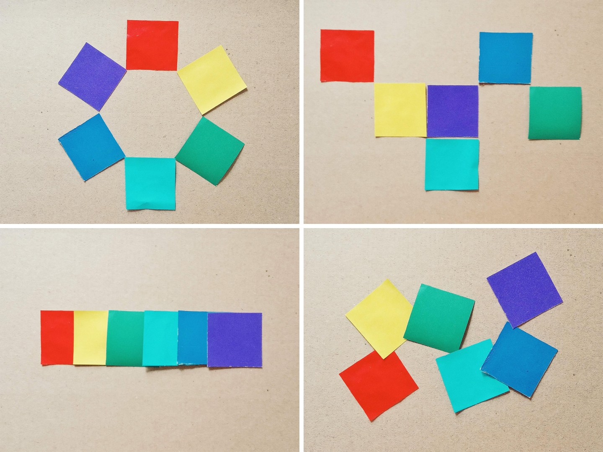

¿Dónde colocamos el elemento más importante? ¿Cómo guiamos el ojo a través del diseño? La disposición responde estas preguntas cruciales.

**La Ley de la Mirada** es un principio fundamental: cuando un sujeto mira hacia un lado, debemos dejar más espacio en esa dirección. Esto permite que el espectador siga naturalmente la línea de visión y complete mentalmente la narrativa.

---

### **Lecciones de los Maestros**

- **El Poder Narrativo de "Guernica"**
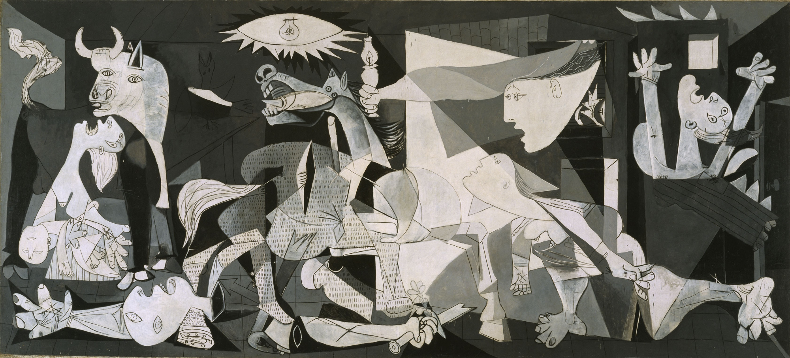
En la obra maestra de Picasso, aparentemente caótica, cada figura está estratégicamente colocada para crear un equilibrio tenso y cargado de significado. Las miradas de los personajes y la disposición de los elementos generan un flujo visual específico que intensifica el impacto emocional del mensaje.

- **Mondrian y el Lenguaje de la Geometría**

Las composiciones de Piet Mondrian son masterclasses en alineación y equilibrio a través de formas geométricas puras. Demuestran cómo los colores y las formas pueden distribuirse meticulosamente para crear una armonía visual perfecta.

- **Warhol y la Magia de la Repetición**
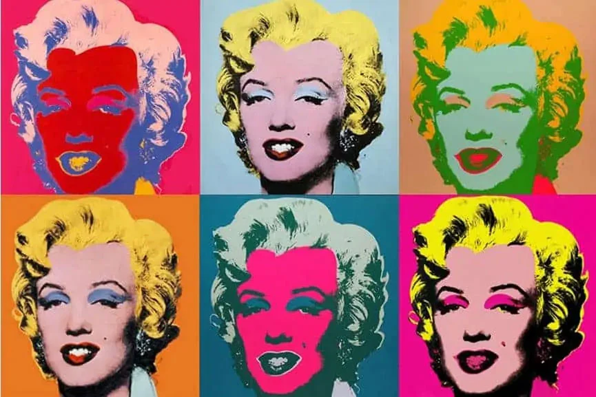
En su serie de Marilyn Monroe, Andy Warhol utiliza la repetición con variaciones sutiles para crear ritmo visual. Esta técnica muestra cómo patrones repetitivos, cuando están bien compuestos, pueden generar un impacto visual memorable y coherente.

---

### **Jerarquía Visual**

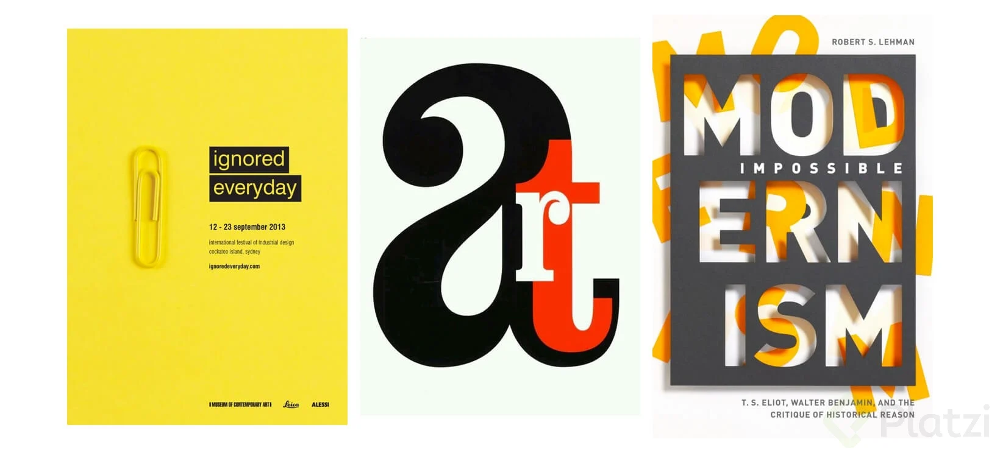

La jerarquía visual es el elemento que determina qué ve primero el espectador, qué ve después y qué queda como fondo. Se establece mediante:

- **Diferencias de tamaño** (lo grande atrae primero)
- **Contraste de color** (los colores vibrantes destacan)
- **Posición en la composición** (ciertas áreas son naturalmente más prominentes)

En un diseño efectivo, la jerarquía debe ser inmediatamente clara, guiando al espectador a través del mensaje de manera intuitiva.

---

### **Consejos para Mejorar Tus Composiciones**

1. **Planifica antes de ejecutar:** Boceta rápidamente varias opciones de composición antes de comprometerte con una.

2. **Busca el equilibrio, no la simetría:** Juega con el peso visual de los elementos según su tamaño, color y complejidad.

3. **Usa el espacio negativo sabiamente:** Las áreas "vacías" son esenciales para dar respiro y destacar los elementos importantes.

4. **Sigue las líneas naturales:** Observa cómo los elementos crean líneas implícitas que pueden guiar la mirada.

5. **Experimenta con puntos focales inusuales:** A veces, colocar el elemento principal fuera del centro crea dinamismo e interés.

### **La Composición como Lenguaje**

Dominar la composición es como aprender un nuevo idioma visual. Una vez internalizas las reglas fundamentales, adquieres la libertad para romperlas creativamente cuando la situación lo requiera.

**La composición efectiva no se nota** cuando está bien ejecutada - simplemente sentimos que la imagen "funciona", que es agradable de observar y fácil de entender. Ese es el verdadero signo de un diseño profesional: la invisibilidad de su técnica al servicio de la claridad de su mensaje.

---

